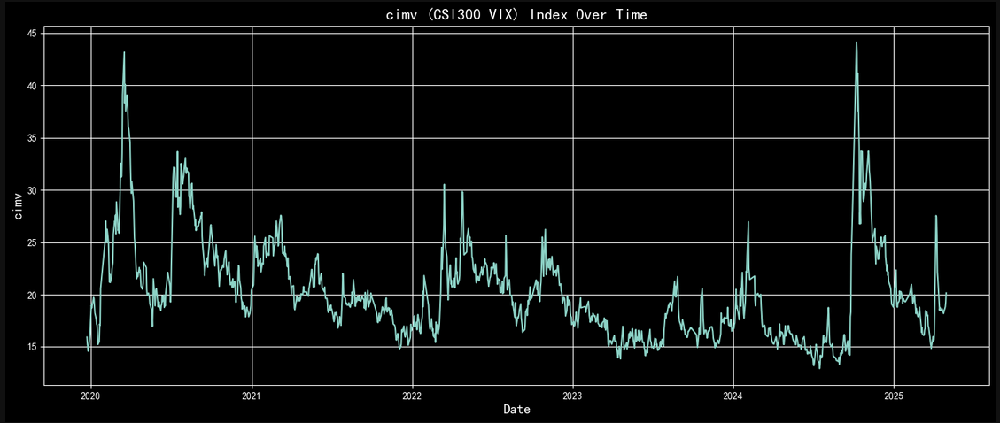

# csi300-vix
Applies methodology of the S&amp;P500 VIX onto the CSI300 index

Builds upon the work of the CIMV project of THU (https://xyfintech.pbcsf.tsinghua.edu.cn/PDF/20220516104342445008.pdf) as well as the original VIX mathematics methodology (https://cdn.cboe.com/api/global/us_indices/governance/Cboe_Volatility_Index_Mathematics_Methodology.pdf)

End result should look like: 

https://github.com/bertie-4z/csi300-vix/blob/main/cimv_graph.png

End result is stored in CIMV_df.pkl

https://github.com/bertie-4z/csi300-vix/blob/main/CIMV_df.pkl

